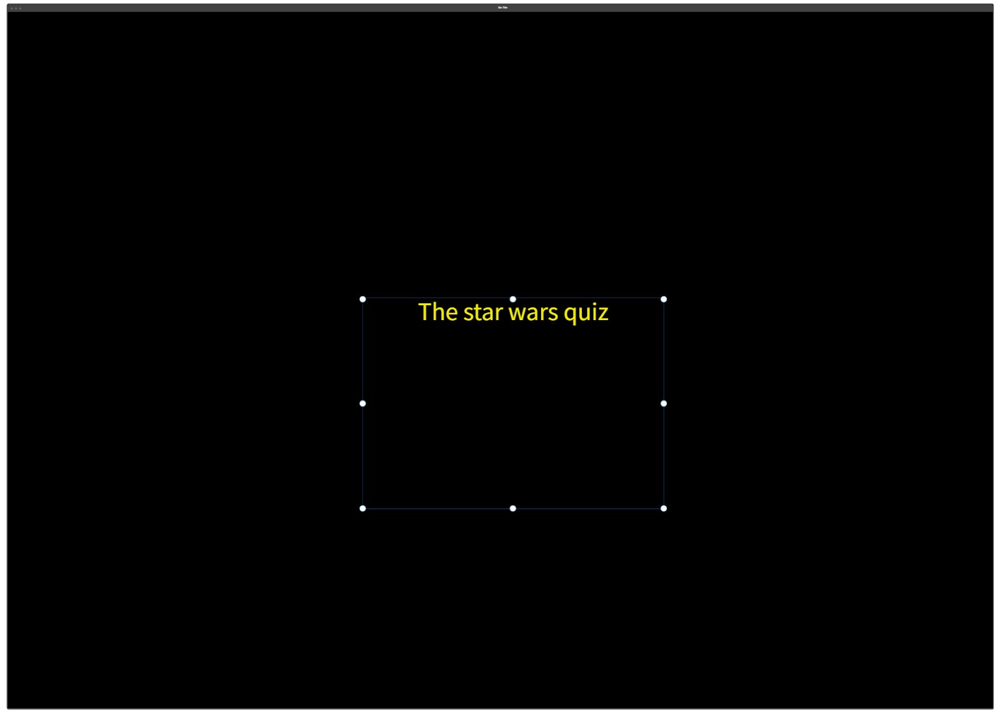

---

# [STARWARS QUIZ](https://benjamin-riordan.github.io/pp2-how-well-do-you-know-star-wars/) - A text based quiz of multiple choice, how well do you know Star Wars?

   

---

---

# CONTENTS

* [USER EXPERIENCE](#USEREXPERIENCE)
    * [Initial Discussion](#Initialdiscussion)
    * [User Stories](#Userstories)
* [Design](#Design)
	* [Colour Scheme](#Colourscheme)
	* [Typography](#Typography)
	* [Imagery](#Imagery)
	* [Wireframes](#Wireframes)
* [Features](#Features)
* [Technolgy used ](#Technolgyused)
* [Testing](#Testing)
	* [Code valadation ](#Codevaladation)
	* [Issues I ran into ](#Issuesiraninto)
	* [Code reviews ](#Codereviews)
	* [Major changes during development](#Majorchnagesduringdevelopment)
	* [Lighthouse](#Lighthouse)
    * [Deployment](#Deployment)
* [Crediations and citataions](#Crediationsandcitataions)
	* [Images](#Images)
	* [Code used](#Codeused)
* [Acknowledgments](#Acknowledgments)
* [Thank you!](#Thankyou!)

---

# USER EXPERIENCE

## Initial Discussion
I wanted the user to learn about Star Wars in a quiz format and give funny feedback about the questions.

## User Stories
Based on the target audience and their needs, the following user stories were identified:

* The site should have different levels of difficulty to accommodate all Star Wars fans.
* The color scheme should be consistent and familiar to Star Wars fans.
* The user should be able to keep track of their score.
* The user should get funny prompts and alerts about their progress.

## Design
The overall design was simple. I wanted an easily navigable page that relied heavily on the content.

## Colour Scheme
I went with a very simplistic black and white background with yellow text and a simple Font Awesome font.

## Typography
I used a simple yet effective font from Font Awesome, "Trispace." Being honest, I used it because it has space in the name.

## Imagery
This site uses only one image, which is a background image. The reason for this was to keep the experience as text-based as possible.

## Wireframes
I created a simple wireframe for the first page layout. Since the page is mostly the same, it works well.

## Features
1. Home/landing page

2. Level selection

3. Quiz based on level

4. End game

# Technology Used
This project primarily relies on JavaScript (JS) to build a dynamic and interactive web application. While HTML and CSS are still utilized, the main focus and driving force behind this project is the extensive use of JavaScript. Here's an overview of how these technologies are employed:

## JavaScript (JS)
JavaScript is a powerful programming language that enables the creation of interactive and dynamic web applications. In this project, JS takes center stage and serves as the primary technology used for development. It allows you to handle user interactions, manipulate HTML elements, perform calculations, make HTTP requests, and dynamically update the content of the web page. JS plays a vital role in enhancing the user experience and adding functionality to the application.

## HTML (Hypertext Markup Language)
HTML is the standard markup language used for structuring the content of web pages. While the focus of this project is on JavaScript, HTML is still necessary to create the basic structure and layout of the web application. It defines the various elements such as headings, paragraphs, links, images, and forms that make up the user interface. HTML provides the foundation for organizing and presenting the content in a logical and hierarchical manner.

## CSS (Cascading Style Sheets)
CSS is a stylesheet language that is responsible for the presentation and styling of web pages. In this project, CSS is used to enhance the visual design and aesthetics of the web application. While the main emphasis lies on JavaScript, CSS still plays a significant role in customizing the appearance of the HTML elements. By applying CSS styles, you can create a visually appealing and consistent user interface.

While HTML and CSS are utilized in this project, the primary focus is on JavaScript. JavaScript enables the creation of a dynamic and interactive web application, allowing for enhanced user experiences and added functionality. By leveraging the power of JavaScript, you can build robust web applications that meet diverse requirements and cater to user needs.

# Testing
| User interaction | Does the function work as intended? (Yes/No) | Why? |
|:---:|:---:|---|
| User clicks on "click me to start the game" | Yes | |
| Alert box picks name | Yes | |
| Level selection loads | Yes | |
| User can pick any level | Yes | |
| Quiz for that level loads | Yes | |
| Score is added up | Yes | |
| Final score is shown with correct message | Yes | |
| Try again button works | Yes | |

## Code Validation

My JS was validated and corrected at some points by JSHint:

My CSS was checked by W3C Validator along with my HTML:

## Issues I Ran Into
From the start, I had issues with this project and a lot of imposter syndrome.

1. Writer's Block and Imposter Syndrome: Experienced periods of writer's block and imposter syndrome, making it challenging to progress with the project.
2. Understanding Redefining JavaScript Variables and Functions: Struggled with comprehending the concept of redeclaring JavaScript variables and functions and properly calling them in the code.
3. Syntax Errors and Indexing: Faced difficulties in dealing with syntax errors and understanding how to properly index arrays or objects in JavaScript.
4. User Inputs: Encountered issues related to handling user inputs and incorporating them into the application's functionality.
5. Difference Between innerHTML, innerText, and .value: Confusion regarding the distinctions between innerHTML, innerText, and .value when manipulating and retrieving content from HTML elements.
6. Logic Flow: Experienced challenges in designing and implementing a logical flow within the application, leading to issues with program behavior and expected outcomes.
7. iOS: iOS gave me massive issues with my hover effects, and after talking with an experienced developer at Auxfuse, he guided me in the right direction.

These are the issues that were encountered during the development process. Each of them presented unique challenges, requiring time and effort to resolve and overcome.

## Lighthouse

## Deployment
1. Create a Repository: Start by creating a new repository on GitHub. Click on the "New" button on your GitHub profile page or navigate to your organization's repository page. Give your repository a name and make sure it's set to public.
2. Add Files to the Repository: Add your website files to the repository. You can either initialize the repository with a README file or manually upload your HTML, CSS, JavaScript, and other necessary files. Ensure that your main HTML file is named index.html.
3. Enable GitHub Pages: On your repository page, navigate to the "Settings" tab. Scroll down to the "GitHub Pages" section. Under "Source," select the branch you want to deploy. If your site is in the root directory, choose the main branch. If your site is in a specific folder, choose the main branch and specify the folder path. Click on the "Save" button.
4. Verify Deployment: After saving, GitHub Pages will provide you with a link to your deployed site. It might take a few minutes for the deployment to complete. Visit the provided link to verify that your site is deployed correctly.
5. Custom Domain (Optional): If you want to use a custom domain for your GitHub Pages site, you can set it up in the "Custom Domain" section of your repository's "Settings" tab. Follow the instructions provided by GitHub to configure your custom domain.
6. Update and Redeploy: Whenever you make changes to your website files, commit and push them to the repository. GitHub Pages will automatically redeploy the updated site. Ensure that your changes are pushed to the correct branch specified in the GitHub Pages settings.

# Credits and Citations
1. All code used is my own, except for the questions section which I got ChatGPT to assemble, and I added it in the JavaScript elements.
2. Auxfuse: A developer friend who helped me figure out the iOS hover issues.
3. Background image was sourced from [Starry Sky Vectors by Vecteezy](https://www.vecteezy.com/free-vector/starry-sky).
4. Carl, Alan, and my class were always on hand to help.

## Code Used
All the code I used is my own.

## Content
The content is from ChatGPT.

## Acknowledgments
I would like to thank my mentor (okwudiri_mentor), my class, and Alan, my cohort facilitator, for helping with this project.

# Thank You!