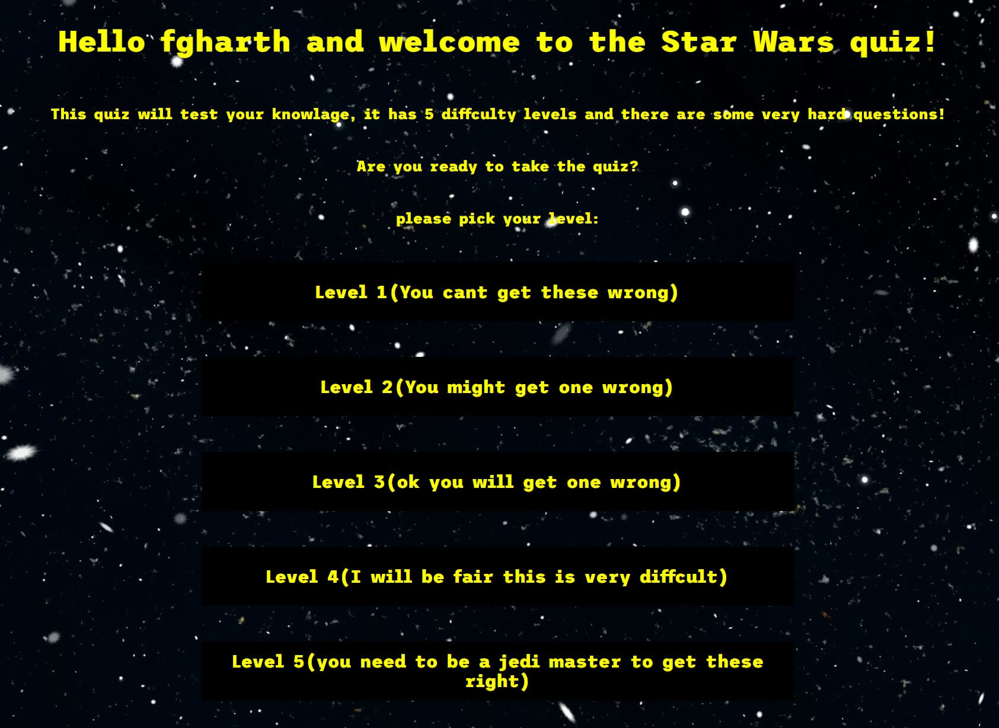

---

# [STARWARS QUIZ](https://benjamin-riordan.github.io/pp2-how-well-do-you-know-star-wars/) -  A text based quiz of multiple choice , how welll do you know star wars?

       

---
---
# CONTENTS

* [USER EXPERIENCE](#USEREXPERIENCE)
    * [Initial Discussion](#Initialdiscussion)
    * [User Stories](#Userstories)
* [Design](#Design)
	* [Colour Scheme](#Colourscheme)
	* [Typography](#Typography)
	* [Imagery](#Imagery)
	* [Wireframes](#Wireframes)
* [Features](#Features)
* [Technolgy used ](#Technolgyused)
* [Testing](#Testing)
	* [Code valadation ](#Codevaladation)
	* [Issues I ran into ](#Issuesiraninto)
	* [Code reviews ](#Codereviews)
	* [Major changes during development](#Majorchnagesduringdevelopment)
	* [Lighthouse](#Lighthouse)
		* [Landing page](#Landingpage)
		* [History Page](#Historypage)
		* [Newsletter](#Newsletter)
		* [Thank you page](#Thankyoupage)
	* [Links](#Links)
    * [Deployment](#Deployment)
* [Crediations and citataions](#Crediationsandcitataions)
	* [Images ](#Images)
	* [Video](#Video)
	* [Code used ](#Codeused)
* [Acknowledgments](#Acknowledgments)
* [Thank you !](#Thankyou!)

    

___

# USER EXPERIENCE

## Initial Discussion
I wanted the user to learn about starwars in a quiz format and give funny feedback about the questions 

## User Stories
Based on the target audience and their needs, the following user stories were identified:

* The site shouuld have diffrent levels of diffculty to accomadate all star wars fans 

* The color there should be consitant and fmailiar with star wars fans

* The user should be able to keep tarck of there score

* The user should get funny promts and alets about there progres

## Design

The over all desing was simple , I wanted and easily naviagtable page that relied healvy on the content of the page. 

## Colour Scheme

I went with a very simplistic back and white background with a yellow text and a simple font awesome font

## Typography

I used a simply yet effeictive font from front awesome "Trispace" -Being honest i used it beacse it has space in the name

## Imagery
This site uses only one image , and that is a background image, the reason for this was to keep the expericne as text based as possble

## Wireframes
I created a simple wireframe for the first page layout -since th page is mostly the same it works well ,

## Features

1. Home/landing page

2. Level selection

3. Quiz based on level

4. End game

# Technology Used
This project primarily relies on JavaScript (JS) to build a dynamic and interactive web application. While HTML and CSS are still utilized, the main focus and driving force behind this project is the extensive use of JavaScript. Here's an overview of how these technologies are employed:

## JavaScript (JS)
JavaScript is a powerful programming language that enables the creation of interactive and dynamic web applications. In this project, JS takes center stage and serves as the primary technology used for development. It allows you to handle user interactions, manipulate HTML elements, perform calculations, make HTTP requests, and dynamically update the content of the web page. JS plays a vital role in enhancing the user experience and adding functionality to the application.

## HTML (Hypertext Markup Language)
HTML is the standard markup language used for structuring the content of web pages. While the focus of this project is on JavaScript, HTML is still necessary to create the basic structure and layout of the web application. It defines the various elements such as headings, paragraphs, links, images, and forms that make up the user interface. HTML provides the foundation for organizing and presenting the content in a logical and hierarchical manner.

## CSS (Cascading Style Sheets)
CSS is a stylesheet language that is responsible for the presentation and styling of web pages. In this project, CSS is used to enhance the visual design and aesthetics of the web application. While the main emphasis lies on JavaScript, CSS still plays a significant role in customizing the appearance of the HTML elements. By applying CSS styles, you can create a visually appealing and consistent user interface.

While HTML and CSS are utilized in this project, the primary focus is on JavaScript. JavaScript enables the creation of a dynamic and interactive web application, allowing for enhanced user experiences and added functionality. By leveraging the power of JavaScript, you can build robust web applications that meet diverse requirements and cater to user needs.

# Testing
| User interaction 	| does the fucntion work as intended yes/no 	| why? 	|
|:---:	|:---:	|---	|
|  user clicks on "click me to start the game  	| yes 	|  	|
| alert box picks name 	| yes 	|  	|
| level selction loads 	| yes 	|  	|
| user can pick any level  	| yes 	|  	|
| quiz for  that level lods 	| yes 	|  	|
| score is added up  	| yes 	|  	|
| final score is shown with coorect message 	| yes 	|  	|
| try again button works  	| yes 	|  	|

## Code validation 

My JS was validated and corrected at some points by jshint

My css was check by W£ validator along with my html

## Issues I ran into-
 From the start i had issues with this project and a lot of imposter sydrome 

1. Writes Block and Imposter Syndrome: Experienced periods of writer's block and imposter syndrome, making it challenging to progress with the project.

2. Understanding Redefining JavaScript Variables and Functions: Struggled with comprehending the concept of redeclaring JavaScript variables and functions and properly calling them in the code.

3. Syntax Errors and Indexing: Faced difficulties in dealing with syntax errors and understanding how to properly index arrays or objects in JavaScript.

4. User Inputs: Encountered issues related to handling user inputs and incorporating them into the application's functionality.

5. Difference Between innerHTML, innerText, and .value: Confusion regarding the distinctions between innerHTML, innerText, and .value when manipulating and retrieving content from HTML elements.

6. Logic Flow: Experienced challenges in designing and implementing a logical flow within the application, leading to issues with program behavior and expected outcomes.

7. ### ios 
 ios gave me massive issues with my hivewr effiects and after talking with an expeirce dev @auxfuse he guided me in the right direction

These are the issues that were encountered during the development process. Each of them presented unique challenges, requiring time and effort to resolve and overcome.

## Lighthouse 

## Links

## Deployment

# Crediations and citataions

## Images 

## Code used 

## Content 

## Acknowledgments

# Thank you !

# atributions and crediations 
<a href="https://www.vecteezy.com/free-vector/starry-sky">Starry Sky Vectors by Vecteezy</a>